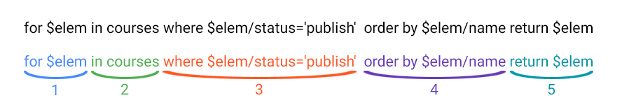

# Синтаксис

Для исполнения XQuery в SP-XML следует использовать запросы вида:  



Данный запрос берет все записи из таблицы `courses` где значение поля `status = "publish"`, полученные записи фильтруются по значению поля `name` и затем возвращаются в виде объекта.

1. Объект в котором хранятся запрашиваемые записи
2. Название таблицы из которой берутся записи. Все записи созданы по одному шаблону, и могут содержать только те поля, которые содержатся в шаблоне.
3. Логическое условие
4. Сортировка записей
5. Результат запроса, объект с отфильтрованными записями

**Пример**

```js
// Получить все записи из таблицы 'vacancies' где state_id = 'vacancy_opened'
arr = XQuery("for $elem in vacancies where $elem/state_id='vacancy_opened' return $elem");

// Получить все записи из таблиц 'vacancies' где is_active = true
arr = XQuery("for $elem in vacancies where $elem/is_active = true() return $elem");

// Получить записи из двух таблиц (получить 'fullname' и 'assessment_name' из таблиц 'collaborators' и 'test_learnings')
arr = XQuery("for $c in collaborators, $t in test_learnings where $c/id=$t/person_id return $c/fullname, $t/assessment_name");

// Получить записи из двух таблиц (выбирает лучшие результаты тестов)
arr = XQuery('for $i in test_learnings, $t in assessments where $i/assessment_id=$t/id and ($t/code="00001" or $t/code="00002" or $t/code="00003" or $t/code="00004") order by $i/score descending return $i');
```


