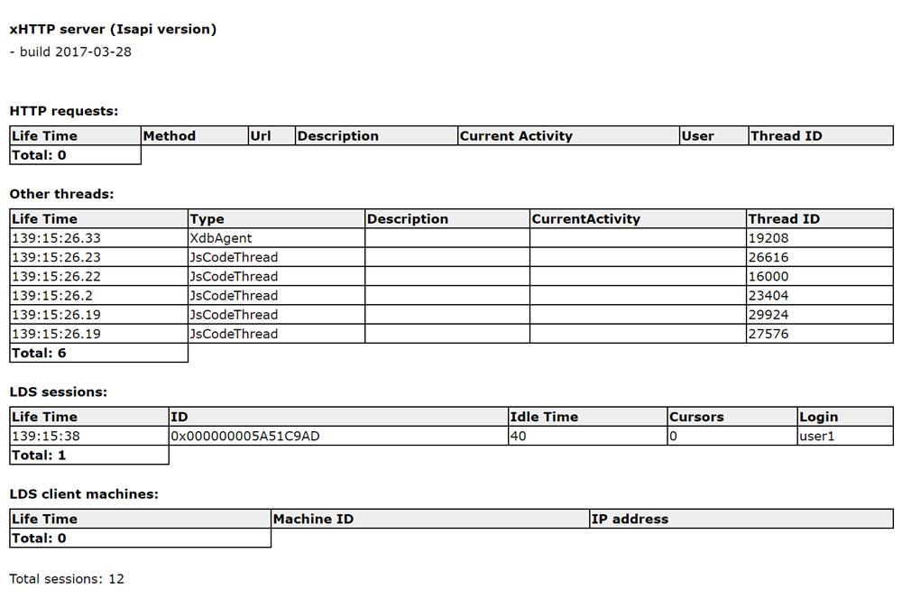

# Отладка

Вот некоторые инструменты, которые помогут при отладке в WebTutor.

## Логи

  Лог-файлы WebTutor лежат в каталоге `C:\Program Files\WebSoft\WebTutorServer\Logs`  
  Помимо просмотра логов напрямую в каталоге, их можно просматривать используя WebTutor Administrator

  

## alert()

  В серверном JavaScriipt WebTutor, параметр функции alert() будет записываться в лог-файл  xhttp-YYYY-MM-DD.log

  ```js
  <%
  // "Hello, World!" появится в логе \WebTutorServer\Logs\xhttp-YYYY-MM-DD.log
  alert('Hello, World!')
  %>
  ```

## try...catch

  Используйте try...catch в серверном коде WebTutor, для получения информации об ошибках, а также для поиска более точного места появления ошибки путем обертывания частей кода внутри try...catch в еще один try...catch

  ```js
  <%
  try {
      function Hello() {
          alert()
      }
  } catch(e) {
      alert('Error function Hello: '+ e.message)
  }
  %>
  ```

## xhttp\_info

  Если пользователь с правами администратора, авторизуется в  WebTutor зайдет по адресу `https://адрес_портала/xhttp_info` , то откроется страница с информацией о текущих операциях сервера.

    

  ### HTTP requests
  
  Показывает, какие и сколько сейчас обрабатывается HTTP запросов сервером WebTutor, увидеть какие из них обрабатываются долго или подвисают, не достигло ли количество запросов максимума (кажется максимум одновременно 255 запросов, после чего система начинает ставить их в очередь, у пользователей находящихся в очереди в такие моменты будет просто белый экран загрузки)

  ### Other threads
  
  Здесь отображаются все остальные активные процессы, обработкой которых сервер сейчас занимается. (к примеру работающие Агенты или какие-нибудь выполняемые операции в WebTutor Administrator(выгрузка отчетов ...))

  ### LDC sessions
  
  Пользователи которые находятся в WebTutor Administrator

  Информация на данной странице очень помогает при поиске причин появления лагов в WebTutor.


