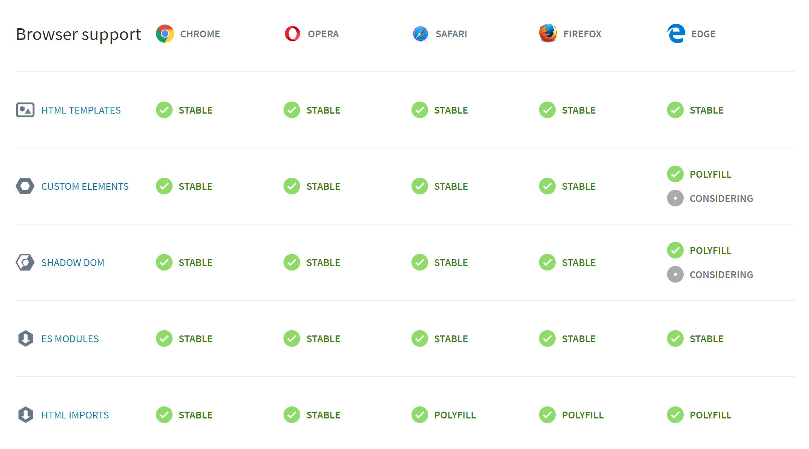

# О Веб-компонентах

    

Сразу надо понять, веб-компоненты(web components) - это не очередная библиотека или фреймворк, это часть платформы(браузера), которая делается W3C(~ c 2012 года), усиленно продвигается Google и используются во многих крупных компаниях в продакшене (YouTube, Bloomberg, EA ...). То есть, как все это работает, рано или поздно придется изучить, так как это уже настоящее и будущее веб.

Чтобы иметь представление о чем речь, посмотрите [по ссылке](https://vaadin.com/elements/browse), что они из себя представляют.

Веб-компоненты могут быть простыми и представлять из себя [кнопку](https://www.webcomponents.org/element/PolymerElements/paper-button), а могут быть огромными, включать в себя много других компонент, которые будут включать в себя еще компоненты и в итоге представлять из себя полноценные [приложения](https://santatracker.google.com).

## Спецификация веб-компонент

В основе веб-компонент лежит четыре спецификации (каждая может быть использована отдельно):

#### 1) [Custom Elements](https://w3c.github.io/webcomponents/spec/custom/)

Создание собственных HTML-элементов

#### 2) [Shadow DOM](https://w3c.github.io/webcomponents/spec/shadow/)

Инкапсуляция DOM и CSS

#### 3) [&lt;script type="module"&gt;](https://jakearchibald.com/2017/es-modules-in-browsers/)

Загрузка веб-компонент

**Внимание!** Раньше для этого использовался [HTML imports](https://w3c.github.io/webcomponents/spec/imports/)(`<link rel="import">`). Но в 2017 было решено использовать ES6 Modules. Вы будете частенько встречать метод загрузки через HTML imports, его работу будут поддерживать еще несколько лет.

#### 4) [HTML Template](https://html.spec.whatwg.org/multipage/scripting.html#the-template-element/)

Отложенный рендер клиентского контента, который не отображается во время загрузки, но может быть инициализирован при помощи JavaScript.

---

Помимо спецификации, почитайте еще вот [тут](https://developers.google.com/web/fundamentals/web-components/) и [тут](https://habrahabr.ru/post/346670/).

---

## Поддержка браузерами

Веб-компоненты можно использовать в браузерах, в которых реализованы 4 указанные выше спецификации.

На данный момент все четыре спецификации реализована в Chrome, Firefox, Safari и Opera. В остальных браузерах они реализованы частично.

На данный момент поддержка веб-компонент браузерами выглядит вот так:

Пока остальные браузеры занимаются у себя осуществлением поддержки недостающих спецификаций(а им это придется сделать или кануть в лету), для них был разработан полифилл [webcomponentsjs](https://github.com/webcomponents/webcomponentsjs), который добавляет поддержку спецификации в браузерах, в которых она отсутствует. Если вкратце, то полифилл [webcomponentsjs](https://github.com/webcomponents/webcomponentsjs), это просто скрипт, который добавляется на страницу и в зависимости от браузера, осуществляет поддержку отсутствующих спецификаций.

### Поддержка Internet Explorer

Смею предположить, что вы являетесь страстным "поклонником" браузеров семейства IE и хотите знать, как обстоят дела с поддержкой веб-компонент в IE? Кто бы мог подумать, но IE11 и его предки не поддерживают ни одной указанной выше спецификации...

В IE11 выручает полифилл [webcomponentsjs](https://github.com/webcomponents/webcomponentsjs) и добавляет поддержку всех четырех спецификаций и тогда веб-компоненты в нем работают.

Что касается предыдущих версий IE, то я наткнулся и на поддержку веб-компонент в IE9, IE10 в [X-Tag](https://x-tag.github.io/) (библиотека для создания веб-компонент от Microsoft). Но фишка в том, что X-Tag, как и все остальные, кто сейчас имеет дело с веб-компонентами используют один и тот же полифилл [webcomponentsjs](https://github.com/webcomponents/webcomponentsjs). И вот, что сказано по поводу поддержки в старых браузерах на странице полифилла [webcomponentsjs](https://github.com/webcomponents/webcomponentsjs):

> Полифилл может работать и в старых браузерах, однако для его использования потребуются дополнительные полифиллы (такие как classList или другие полифиллы [платформы](https://github.com/webcomponents/webcomponents-platform)). Мы не можем гарантировать поддержку для браузеров вне нашей матрицы совместимости.

В матрице совместимости у них указан только IE11, так что думаю логично предположить, что поддержки IE9, IE10 нет. (возможно была когда-то) и стоит рассчитывать только на IE11.

(Microsoft перестал поддерживать все версии IE кроме IE11 еще в 2016 году.)

