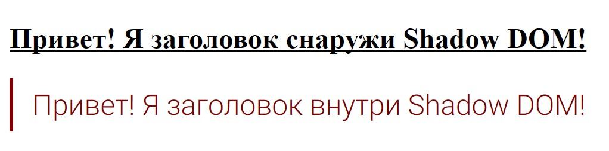
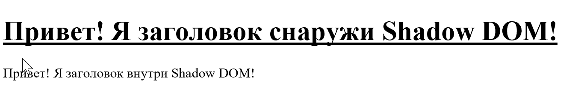
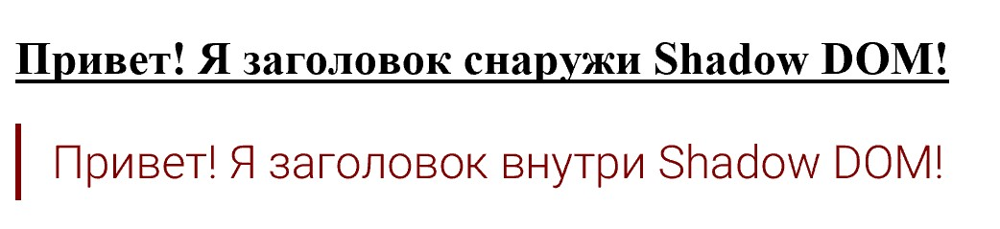

# Проверяем инкапсуляцию

Проверим действительно ли все так, как написано в спецификации веб-компонент и их DOM c CSS инкапсулированы.

Создадим простенькую веб-компоненту, которая будет представлять из себя элемент `<h1>` с измененными стилями и попытаемся воздействовать на нее извне.

Для этого понадобится текстовый редактор и установленный [Node.js](https://nodejs.org/en/).

В командной строке:

(можете использовать и стандартную командную строку Windows, но рекомендуем использовать сторонние, более удобные программы, например терминал в [Visual Studio Code](https://code.visualstudio.com/) или [ConEmu](https://conemu.github.io/))

Установим сервер, который будем использовать во время разработки  (можете использовать свой сервер):

В командной строке пишем

`npm install http-server -g` + Enter

Создадим каталог в котором будем работать

`cd C:\` + Enter

`mkdir h1-sample` + Enter

Входим в него

`cd h1-sample` + Enter

Запускаем сервер

`http-server` + Enter

## Проверка в Chrome

Сначала проверим как работает инкапсуляция в браузере где реализована поддержка всех четырех спецификаций веб-компонент.

В каталоге `h1-sample` создадим файл index.html с таким содержимым

```html
<!DOCTYPE html>
<html lang="en">

<head>
    <meta charset="UTF-8">
    <title>Incapsulation test</title>
    <script type="module" src="h1-sample.js"></script>
    <style>
    h1 {
        text-decoration: underline;
    }
    </style>
</head>

<body>
    <h1>Привет! Я заголовок снаружи Shadow DOM!</h1>
    <h1-sample>Привет! Я заголовок внутри Shadow DOM!</h1-sample>
</body>

</html>
```

и h1-sample.js с таким

```js
'use strict'
class H1Sample extends HTMLElement {
    connectedCallback() {
        let template = document.createElement('template')
        template.innerHTML = `
        <style>
            :host {
                display: block;
                position: relative;
                box-sizing: border-box;  
            }

            h1 {
                color: maroon;
                border-left: 3px solid maroon;
                padding: 8px 16px;
                font-family:'Roboto';
                font-weight: 300;
                font-size: 32px;
                margin:0;
            }
        </style>
        <h1><slot></slot></h1>
        `
        this.attachShadow({
            mode: 'open'
        })
        this.shadowRoot.appendChild(document.importNode(template.content, true))
    }
}

customElements.define('h1-sample', H1Sample)
```

Смотрим результат в ChromeСупер! Все работает как и задумано. CSS снаружи веб-компоненты не попадает в нее, а CSS внутри не выходит наружу.

В браузерах Firefox, Safari, Opera, Yandex тоже все будет работать, так как в них тоже реализована полная поддержка веб-компонент.

## Проверка в IE11

А теперь попробуем тоже самое в браузере, который не поддерживает(и не планирует) ни одной из четырех спецификаций веб-компонент.Ничего не работает. Попробуем подключить полифиллы, которые добавят поддержку необходимых спецификаций.

Все необходимые полифиллы для осуществления поддержки веб-компонент находятся в [webcomponentsjs](https://github.com/webcomponents/webcomponentsjs).

В командной строке пишем

`npm install @webcomponents/webcomponentsjs` + Enter

В index.html делаем вот такие изменения

```html
<!DOCTYPE html>
<html lang="en">

<head>
    <meta charset="UTF-8">
    <title>Incapsulation test</title>
    <script src="node_modules/@webcomponents/webcomponentsjs/webcomponents-lite.js"></script>
    <script type="module" src="h1-sample.js"></script>
    <script nomodule src="h1-sample-compiled.js"></script>
    <style>
    h1 {
        text-decoration: underline;
    }
    </style>
</head>

<body>
    <h1>Привет! Я заголовок снаружи Shadow DOM!</h1>
    <h1-sample>Привет! Я заголовок внутри Shadow DOM!</h1-sample>
</body>

</html>
```

Что мы изменили:

* Добавили на страницу скрипт webcomponents-lite.js, который добавит все необходимые полифиллы. Все будет работать, но добавил я webcomponents-lite.js только в демонстрационных целях. В реальных проектах такого делать не стоит. У webcomponentsjs довольно много возможностей загрузки. Во первых надо загружать асинхронно и загружать, только те полифиллы, которые будут необходимы, а не все, как это сделано сейчас. Подробности того, как это делается на странице полифилла [webcomponentsjs](https://github.com/webcomponents/webcomponentsjs).
* Добавили `<script nomodule src="/h1-sample-compiled.js"></script>`. Так как IE11 не знает, что такое `type="module"`, он это загружать не будет. А вот скрипт с `nomodule` загрузит. Современные же браузеры с поддержкой импорта модулей будут делать наоборот. Подробности можете почитать [тут](https://jakearchibald.com/2017/es-modules-in-browsers#nomodule-for-backwards-compatibility). 
  А вот что такое `h1-sample-compiled.js` будет рассказано чуть ниже.

В h1-sample.js делаем вот так

```js
'use strict'
class H1Sample extends HTMLElement {
    connectedCallback() {
        let template = document.createElement('template')
        template.innerHTML = `
        <style>
            :host {
                display: block;
                position: relative;
                box-sizing: border-box;  
            }

            h1 {
                color: maroon;
                border-left: 3px solid maroon;
                padding: 8px 16px;
                font-family:'Roboto';
                font-weight: 300;
                font-size: 32px;
                margin:0;
            }
        </style>
        <h1><slot></slot></h1>
        `
        ShadyCSS.prepareTemplate(template, 'h1-sample')
        ShadyCSS.styleElement(this)
        this.attachShadow({
            mode: 'open'
        })
        this.shadowRoot.appendChild(document.importNode(template.content, true))
    }
}

customElements.define('h1-sample', H1Sample)
```

Что мы изменили:

* Добавили пару строчек кода, тем самым осуществили частичную поддержку ShadowDOM и частичную инкапсуляцию CSS с помощью полифиллов [ShadyDOM](https://github.com/webcomponents/shadydom) и [ShadyCSS](https://github.com/webcomponents/shadycss) (данные полифиллы уже встроены в webcomponentsjs не надо их отдельно подгружать)

Мы добавили все необходимые полифиллы для работы веб-компонент в браузерах где пока нет их поддержки.

Сейчас мы бы уже могли посмотреть результат изменений в браузерах Chrome, Firefox, Safari, Edge, Opera, Yandex и др., но только не в IE11...

Помимо добаваления полифиллов, для работы веб-компонент, браузер должен поддерживать ES6 (а именно ES6 classes,  которые нужны для Custom Elements).

Проблема в том, что IE11 поддерживает только ES5, в отличие от других наиболее популярных браузеров, которые поддерживают ES6.

В итоге, чтобы наша компонента заработала в IE11, необходимо как-то скомпилировать код нашей компоненты в файле h1-sample.js из ES6 в ES5. В подобной компиляции поможет [Babel](https://babeljs.io).

### Babel

[Babel](https://babeljs.io) - это компилятор JavaScript. Он позволяет использовать новый синтаксис JavaScript прямо сейчас, не дожидаясь пока браузеры осуществят полную поддержку. Также с его помощью можно добавлять в код необходимые вам полифиллы. Можете встроить его в свою сборку проекта. Babel может много чего еще, ищите подробности на сайте [Babel](https://babeljs.io), чрезвычайно полезный инструмент.

В нашей ситуации, нам понадобится только компиляция ES6 в ES5.

Установим Babel (пишем в нашей командной строке):

`npm install babel-preset-es2015` + Enter

`babel --presets es2015 h1-sample.js -o h1-sample-compiled.js` + Enter

Смотрим результат:На первый взгляд вроде все заработало как надо, но нет. Нижний текст не должен быть подчеркнут. Стили внутри веб-компоненты не выходят наружу, тут все ок. А вот внешние стили попадают внутрь веб-компоненты и воздействуют на них. Так происходит потому, что у полифилла ShadyCSS есть ограничение и стили находящиеся на уровне документа попадают в веб-компоненты. (подробнее [тут](https://github.com/webcomponents/shadycss#document-level-styling-is-not-scoped-by-default))

В принципе даже такой вариант с частичной инкапсуляцией уже неплох и позволяет делать внутри своей веб-компоненты все, что угодно с CSS, не боясь, что это будет воздействовать на окружение, но хочется, чтобы никакие стили снаружи не попадали в веб-компоненту.

Данная проблема касается не только IE11, а всех браузеров в которых пока не осуществлена поддержка Shadow DOM. (на данный момент это Edge)

### Реализация полной инкапсуляции при использовании полифиллов

В результате поиска решения проблемы было найдено 4 варианта. (делать тут ничего не надо, просто смотрим)

#### 1) [CustomStyleInterface](https://github.com/webcomponents/shadycss#about-customstyleinterface)

Этот вариант со страницы полифилла [ShadyCSS](https://github.com/webcomponents/shadycss)

* добавляем тегу &lt;style&gt;, id или класс
* после полифиллов webcomponents-lite.js, добавляем custom-style-interface.min.js (добавляет CustomStyleInterface в ShadyCSS)
* затем выбираем наш &lt;style&gt; тег и обрабатываем с помощью ShadyCSS.CustomStyleInterface.addCustomStyle

```html
<style class="document-style">
    h1 {
        text-decoration: underline;
    }
</style>
<script src="node_modules/@webcomponents/webcomponentsjs/webcomponents-lite.js"></script>
<script src="node_modules/@webcomponents/shadycss/custom-style-interface.min.js"></script>
<script>
ShadyCSS.CustomStyleInterface.addCustomStyle(document.querySelector('.document-style'))
</script>
```

#### 2) [&lt;custom-style&gt;](https://github.com/webcomponents/shadycss#about-customstyleinterface)

Этот вариант тоже со страницы полифилла [ShadyCSS](https://github.com/webcomponents/shadycss)

* &lt;style&gt; переносим в &lt;custom-style&gt;
* после полифиллов webcomponents-lite.js, добавляем custom-style-interface.min.js (добавляет CustomStyleInterface в ShadyCSS
* регистрируем custom-style елемент (+ для IE11 код регистрации надо прогнать через Babel)

```html
<custom-style>
    <style>
        h1 {
            text-decoration: underline;
        }
    </style>
</custom-style>
<script src="node_modules/@webcomponents/webcomponentsjs/webcomponents-lite.js"></script>
<script src="node_modules/@webcomponents/shadycss/custom-style-interface.min.js"></script>
<script>
class CustomStyle extends HTMLElement {
  constructor() {
    super()
    ShadyCSS.CustomStyleInterface.addCustomStyle(this)
  }
  getStyle() {
    return this.querySelector('style')
  }
}
customElements.define('custom-style', CustomStyle)
</script>
```

---

При реализации одного из этих вариантов, стили действительно становятся инкапсулированы, как-будто они в Shadow DOM. То есть внешние стили перестают попадать в веб-компоненту h1-sample, а стили внутри h1-sample не выходят наружу. Но не все так радужно. Эти два варианта рабочие, но только при определенных условиях.

Одно из условий:

* все стили должны находится в тегах &lt;style&gt;  (то есть нельзя подключить стили через тег &lt;link rel="stylesheet"&gt;)

Если у вас простенькое приложение или сайт, поддержкой которого занимаетесь только вы или небольшая группа людей, то все ок, можно спокойно использовать эти два варианта. Но если у вас большая система, где стили подгружаются в разных местах и различными способами + обновлениями помимо вас занимаются разработчики системы и внешние разработчики, то эти два варианта не работают. Нужно что-то более универсальное.

На помощь приходят два следующих варианта

#### 3) iframe + [iframe-resizer](https://github.com/davidjbradshaw/iframe-resizer)

Старый добрый iframe. Вообщем, пока браузер Edge не добавили поддержку Shadow DOM и пока жив IE11, можно поместить свои компоненты по старинке в iframe с поддержкой [iframe-resizer](https://github.com/davidjbradshaw/iframe-resizer), чтобы iframe динамически менял свой размер.

#### 4) [Cleanslate](https://github.com/premasagar/cleanslate)

Долго думал, как же еще можно предотвратить попадание стилей в веб-компоненту и наткнулся на библиотеку [Cleanslate](https://github.com/premasagar/cleanslate) и реализовал свой "костыль", который вроде работает и стили снаружи в веб-компоненту не попадают. Если вкратце, то вы добавляете элементу класс `cleanslate`, который устанавливает элементу стили по умолчанию перезатирая существующие. Но в отличие от 3 предыдущих вариантов этот вариант, полную инкапсуляцию стилей не обеспечивает и в веб-компоненту могут проникнуть стили с `!important`.

Подозреваю, что с iframe имели дело почти все и отобразить через него компоненту, особых проблем не составит, а если и составит, то в интернете куча информации, по iframe и работе с ним. Так что будем реализовывать инкапсуляцию через Cleanslate.

### Добавляем поддержку Cleanslate

В командной строке пишем

`npm install cleanslate` + Enter

В index.html делаем вот так

```html
<!DOCTYPE html>
<html lang="en">

<head>
    <meta charset="UTF-8">
    <title>Incapsulation test</title>
    <script src="node_modules/@webcomponents/webcomponentsjs/webcomponents-lite.js"></script>
    <link rel="stylesheet" href="node_modules/cleanslate/cleanslate.css">
    <script type="module" src="h1-sample.js"></script>
    <script nomodule src="h1-sample-compiled.js"></script>
    <style>
    h1 {
        text-decoration: underline;
    }
    </style>
</head>

<body>
    <h1>Привет! Я заголовок снаружи Shadow DOM!</h1>
    <h1-sample>Привет! Я заголовок внутри Shadow DOM!</h1-sample>
</body>

</html>
```

Что мы изменили:

* Добавили стили `<link rel="stylesheet" href="node_modules/cleanslate/cleanslate.css">`

В h1-sample.js делаем вот так

```js
'use strict'
class H1Sample extends HTMLElement {
    connectedCallback() {
        let template = document.createElement('template')
        template.innerHTML = `
        <style>
            :host {
                display: block;
                position: relative;
                box-sizing: border-box;  
            }

            h1 {
                color: maroon !important;
                border-left: 3px solid maroon !important;
                padding: 8px 16px !important;
                font-family:'Roboto' !important;
                font-weight: 300 !important;
                font-size: 32px !important;
                margin:0 !important;
            }
        </style>
        <h1 class="cleanslate"><slot></slot></h1>
        `
        ShadyCSS.prepareTemplate(template, 'h1-sample')
        ShadyCSS.styleElement(this)
        this.attachShadow({
            mode: 'open'
        })
        this.shadowRoot.appendChild(document.importNode(template.content, true))
    }
}

customElements.define('h1-sample', H1Sample)
```

Что мы изменили:

* Добавили тегу h1 `class="cleanslate"`
* Добавили всем(кроме :host) стилям `!important`

Смотрим результат:Теперь все ок.

Созданная компонента доступна по [ссылке](https://github.com/maksimyurkov/h1-sample).

## Выводы

Инкапсуляция работает.

Относительно поддержки веб-компонент, браузеры делятся на три категории:

* #### Поддерживают (Chrome, Firefox, Safari, Opera, Yandex)

В данных браузерах все супер. Все работает, минимум кода, полная инкапсуляция.

* #### Частично поддерживают (Edge)

В данных браузерах реализована только часть спецификаций веб-компонент. Оставшаяся часть уже на подходе. А пока полная поддержка веб-компонент в данных браузерах не реализована, необходимо вместе с веб-компонентами использовать полифиллы [webcomponentsjs](https://github.com/webcomponents/webcomponentsjs). Но даже с полифиллами инкапсуляция получается частичная и в веб-компоненты попадают стили снаружи, приходится использовать различные приемы, чтобы предотвратить эту утечку стилей, после которых веб-компоненты становятся инкапсулированы.

* #### Не поддерживают (IE11)

В IE11 поддержки нет и никогда не будет. Помимо отсутствия поддержки спецификаций веб-компонент, IE вдобавок не поддерживает ES6.

То есть помимо добавления полифиллов приходится еще и компилировать код из ES6 в ES5 с помощью Babel.

C IE11 и без веб-компонент, полифиллов и компиляций проблем хватает.

Будем надеется, что Microsoft похоронит наконец семейство IE и их полностью заменит Edge.

