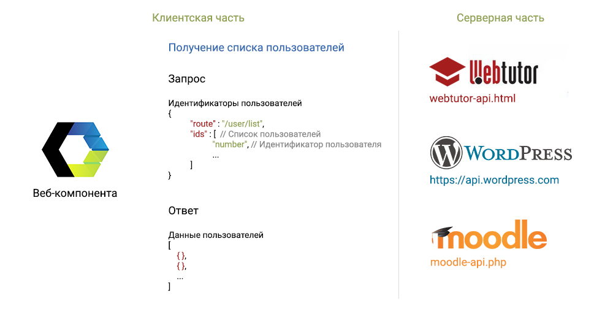
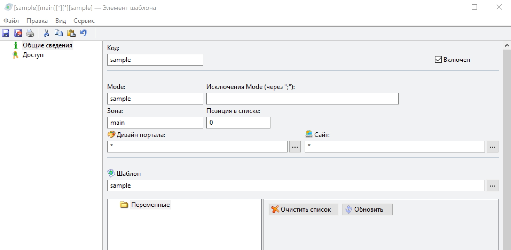
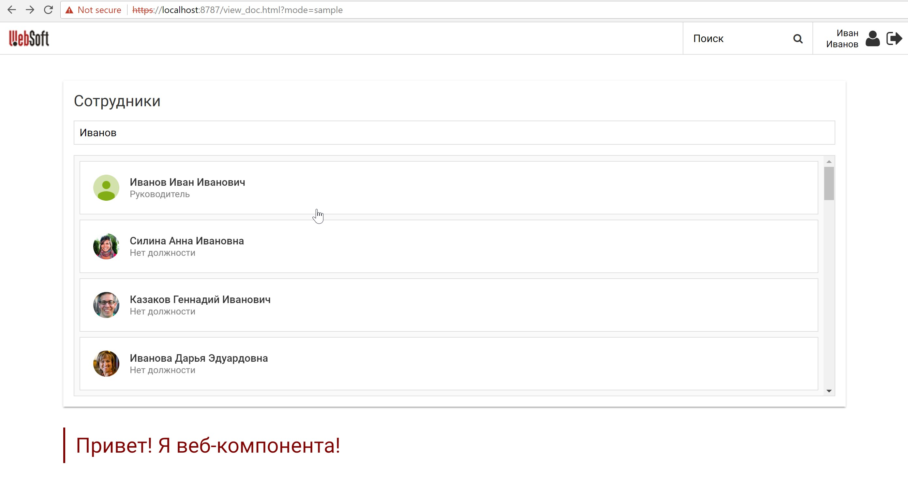

# Делаем веб-компоненту для WebTutor

Здесь будет рассмотрено как создавать веб-компоненту, которая взаимодействует с WebTutor или другой похожей системой. Здесь будет представлен только один из возможных подходов.

При разработке веб-компоненты, которая должна осуществлять запросы, необходимо полностью разделять клиентскую и серверную часть. Серверную часть, можно даже вынести в отдельный модуль. Подобное отделение позволяет сделать веб-компоненту более гибкой и эта гибкость позволяет заменять серверную часть при необходимости, ничего не меняя в клиентской части.

То есть, вы делаете веб-компоненту, которая взаимодействует с WebTutor, но затем кто угодно может добавить поддержку для своей системы\(к примеру Moodle, WordPress итп\), добавив свой серверный модуль. Подобный подход позволяет вам делать максимально полезные веб-компоненты, которые будут охватывать множество различных систем и соответственно приносить пользу огромной массе людей. На картинке показаны основные составляющие подобной "гибкой" веб-компоненты: клиентская и серверная часть. Клиентская часть обычно делается независимой. Серверная часть делается зависимой от клиентской и должна уметь обрабатывать запросы приходящие с клиентской части и делать соответствующие ответы. В запросах и ответах используется JSON формат. Серверная часть представляет из себя, некое подобие API. Серверная часть, к которой осуществляются запросы, может представлять из себя обычный файл лежащий на сервере\(например webtutor-api.html или moodle-api.php\) или отдельный выделенный под API сервер\(например [https://api.wordpress.com](https://api.wordpress.com)\)

Как вкратце происходит взаимодействие

1. Веб-компонента делает GET или POST запрос к вашей серверной части
2. Серверная часть обрабатывает запрос, после чего формирует ответ в JSON формате
3. Веб-компонента получает ответ

Если у вас не установлен WebTutor, пройдите по [ссылке](/test-system/) для установки тестовой системы.

[employees-sample](https://github.com/maksimyurkov/employees-sample) - небольшая веб-компонента, которая будет взаимодействовать с WebTutor.

Данная веб-компонента подгружает список сотрудников, после этого, когда вы начинаете вводить в поле часть ФИО сотрудника, после ввода более 3-х символов осуществляется поиск и выводится список найденных сотрудников.

### Устанавливаем веб-компоненту

Открываем командную строку и пишем \(после каждой строки жмем Enter\):

`cd C:\Program Files\WebSoft\WebTutorServer\wt\web` (директория может отличаться от вашей)

`mkdir components`

`cd components`

`git clone https://github.com/maksimyurkov/employees-sample` (установите [git](https://git-scm.com/downloads) если данная команда не сработает)

`cd employees-sample`

`npm install`

`cd ../`

За компанию установим веб-компоненту из предыдущего раздела

`git clone https://github.com/maksimyurkov/h1-sample`

`cd h1-sample`

`npm install`

### Добавляем веб-компоненты на страницу WebTutor

В WebTutor Administrator в разделе `Дизайнер` - `Шаблоны документов`, создаем произвольный шаблон с таким содержимым:

```html
<style>
employees-sample, h1-sample {
    margin-top: 32px;
}
</style>

<!--Подгружаем полифиллы-->
<script src="/components/employees-sample/node_modules/@webcomponents/webcomponentsjs/webcomponents-lite.js"></script>
<link rel="stylesheet" href="/components/employees-sample/node_modules/cleanslate/cleanslate.css">

<!--Добавляем employees-sample-->
<script type="module" src="/components/employees-sample/employees-sample-es6.js"></script>
<script nomodule src="/components/employees-sample/employees-sample-es5.js"></script>
<employees-sample api-url="/components/employees-sample/webtutor-api.html" default-avatar-url="/components/employees-sample/default-avatar.jpg"></employees-sample>

<!--Добавляем h1-sample-->
<script type="module" src="/components/h1-sample/h1-sample.js"></script>
<script nomodule src="/components/h1-sample/h1-sample-compiled.js"></script>
<h1-sample>Привет! Я веб-компонента!</h1-sample>
```

Затем в `Дизайнер` - `Элементы шаблонов`, создаем шаблон и прикрепляем к нему шаблон созданный выше.


Смотрим результат  

Если в будущем, в другой системе, к примеру Moodle, понадобится функционал employees-sample, то будет достаточно создать один серверный файл, к примеру moodle-api.php + в атрибутах веб-компоненты прописать путь до этого файла.

```html
<employees-sample api-url="/components/employees-sample/moodle-api.php" default-avatar-url="/components/employees-sample/default-avatar.jpg"></employees-sample>
```

После этого веб-компонента будет работать и выглядеть в Moodle, также как и в WebTutor.

