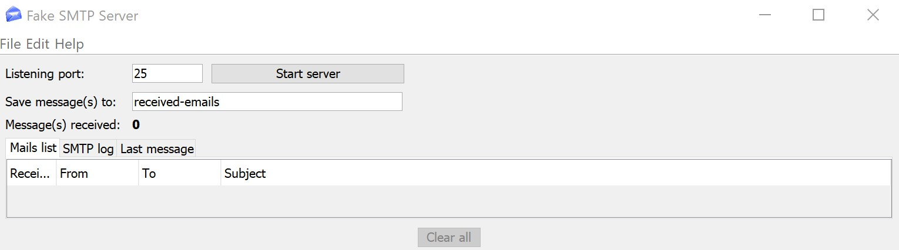
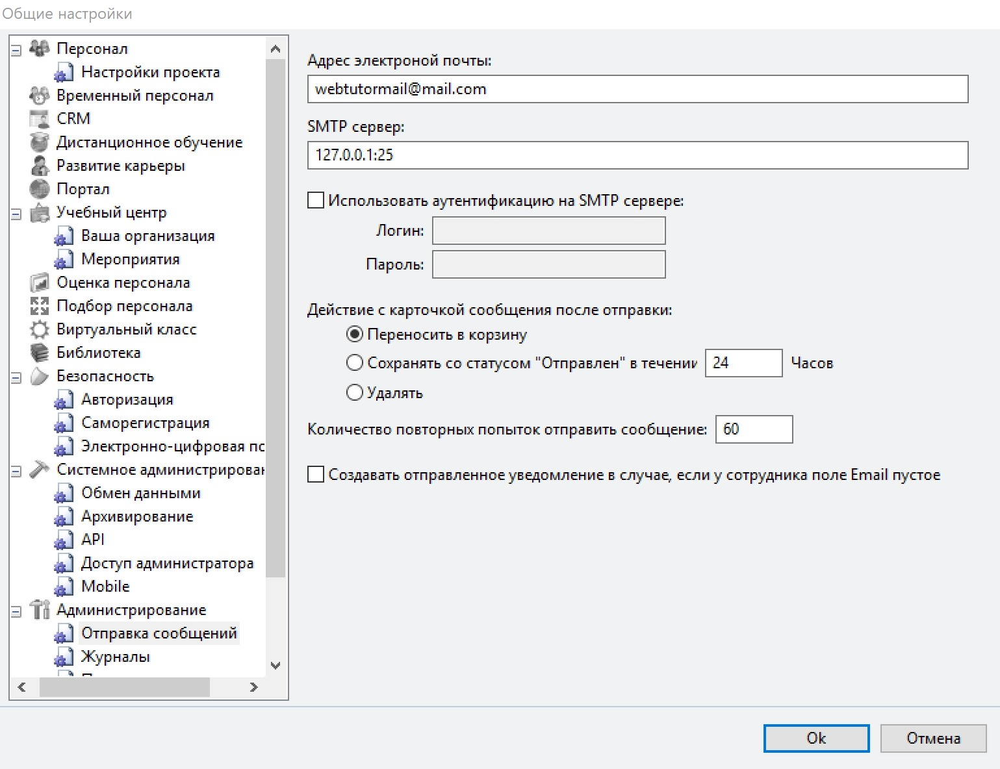

# Подключение WebTutor к SMTP

При разработке в WebTutor частенько приходится иметь дело с уведомлениями.

Сейчас при отправке уведомлений ничего не происходит, уведомления не появляются в `Системное администрирование` - `Неотправленные уведомления`. Так происходит потому в настройках WebTutor не прописан SMTP сервер.

Если у вас есть в наличии SMTP сервер, то пропишите его в настройках и у вас все заработает.

Но для тестовой системы, SMTP обычно не находится, искать в интернете и настраивать свой SMTP желания особо нет, да и обычно в полноценном SMTP и реальной отправке уведомлений нет необходимости, при разработке достаточно видеть, когда и какие создаются уведомления и какое у них содержимое.

Как реализовать такой вариант:

1. Скачиваем и запускаем программу [FakeSMTP](http://nilhcem.com/FakeSMTP/download.html)

2. Жмем `Start server`  

   

3. В WebTutor Administrator в разделе `Сервис` - `Общие настройки` - `Администрирование` - `Отправка сообщений` заполняем:

   **Адрес электронной почты** = на свое усмотрение  
   **SMTP сервер** = 127.0.0.1:25  

   

Готово! Теперь уведомления будут появляться в `Неотправленные уведомления` затем `FakeSMTP` будет их "отправлять" после чего они будут перемещаться в `Корзина`

