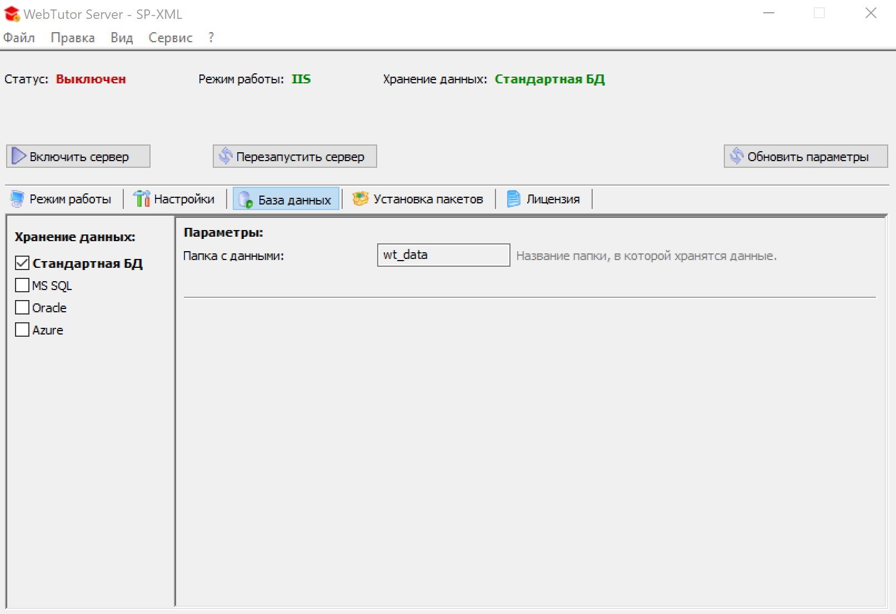
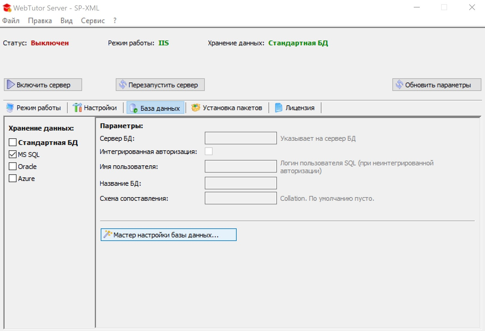
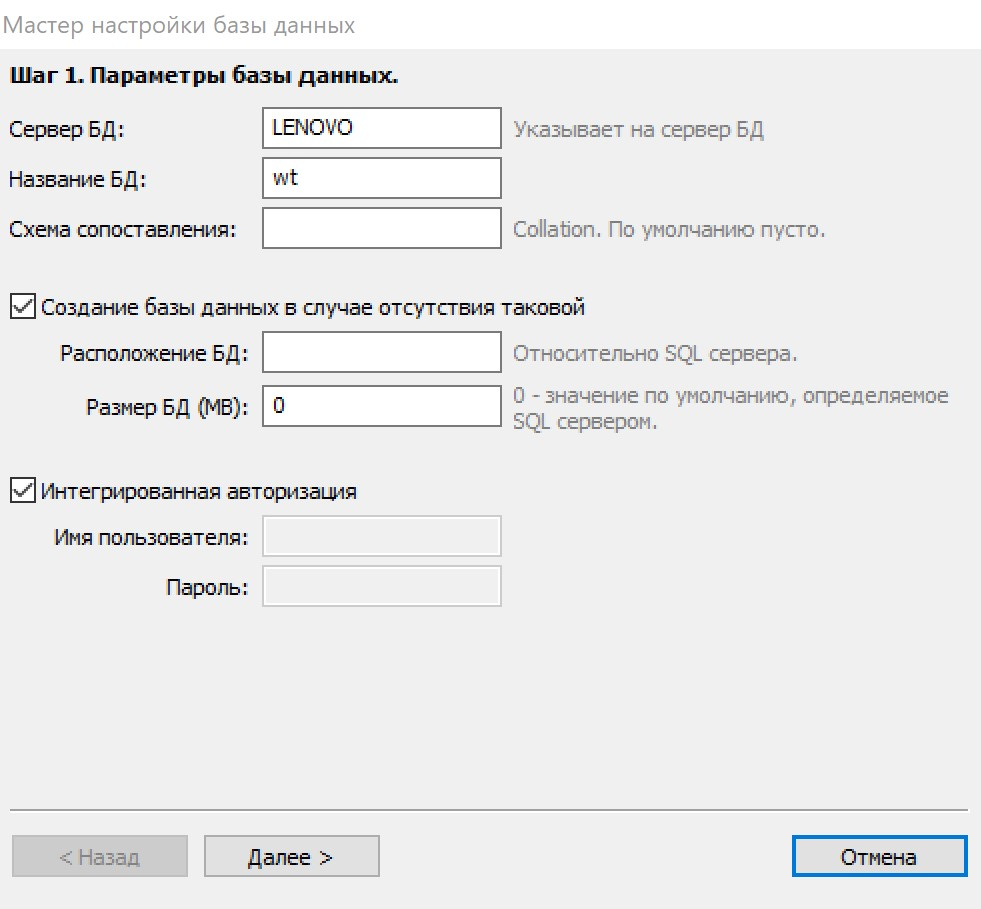
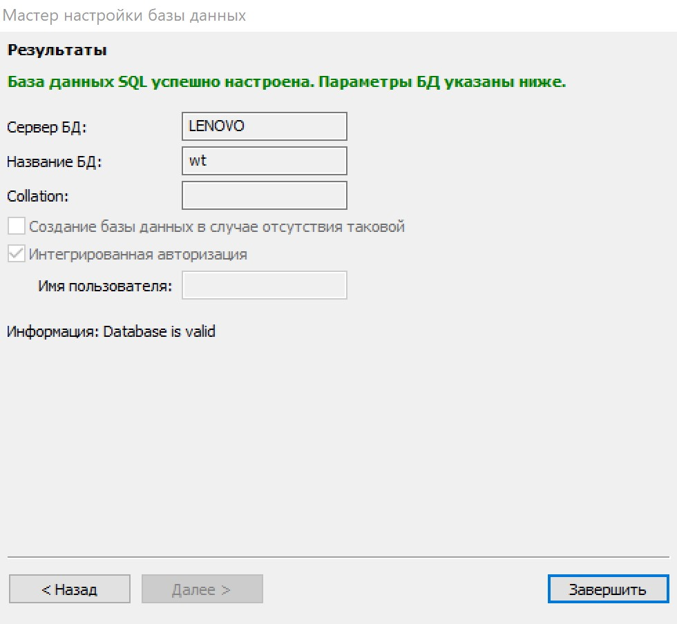

# Подключение WebTutor к SQL Server

1. В WebTutor Server заходим во вкладку `База данных`

2. Переключаем хранение данных на `MS SQL` и жмем на `Мастер настройки базы данных...`

3. Заполняем поля, жмем `Далее`  
   **Сервер БД** = Имя SQL сервера (можете посмотреть имя в SSMS)  
   **Название БД** = wt  
   **Поставить галку:** Создание базы данных в случае отсутствия таковой  
   **Поставить галку:** Интегрированная авторизация
   
   

4. Жмем `Далее`

5. Жмем `Завершить`

6. Если вам необходим полнотекстовый поиск, используйте [инструкцию](http://news.websoft.ru/view_doc.html?mode=doc&doc_id=5900009198344233435) для создания SQL Job.

