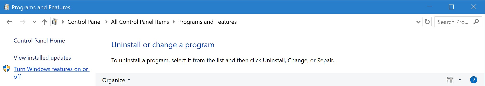
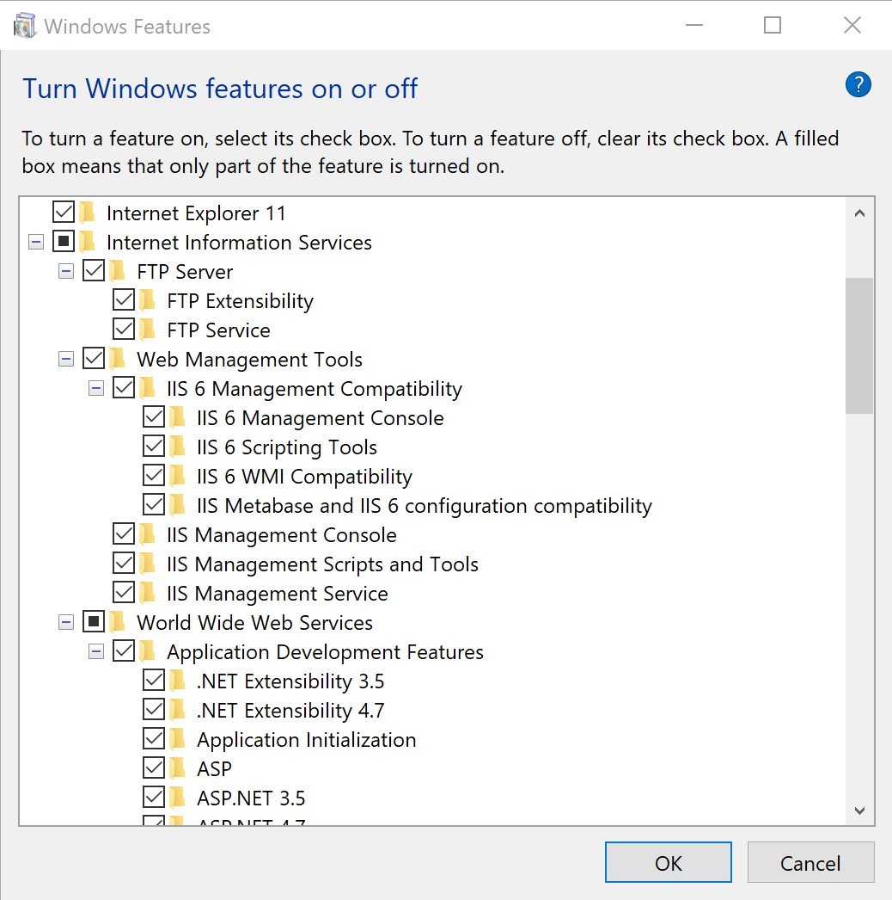

# Установка IIS

1. В Windows переходим в `Control Panel (Панель управления)` - `Programs and Features (Программы и компоненты)` - `Turn Windows features on or off (Включение или отключение компонентов в Windows)`  

   

2. Выделяем все компоненты входящие в Internet Information Services за исключением `WebDAV Publishing (Веб-публикация DAV)`, жмем `OK`  

   

