# Установка WebTutor

1. Скачиваем WebTutor 3.4.0(38) (ссылку необходимо запросить в [службе поддержки WebSoft](http://news.websoft.ru))
2. Запускаем
3. Выбираем `Русский`, жмем `OK`

   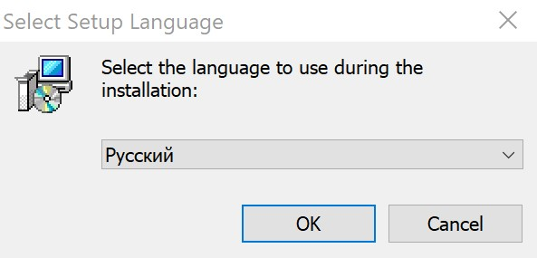

4. Жмем `Далее`  

   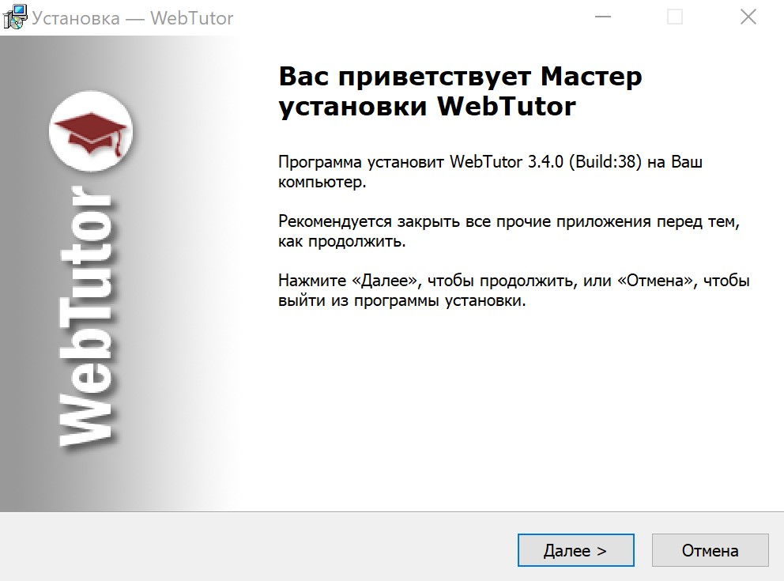

5. Принимаем условия, жмем `Далее`  

   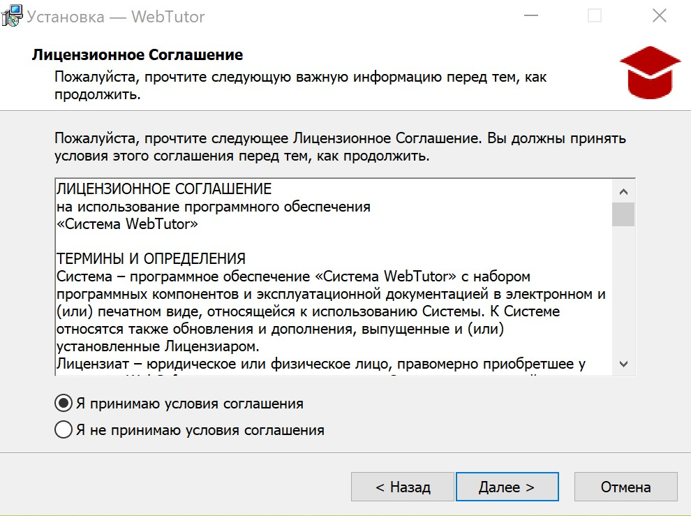

6. Жмем `Далее`  

   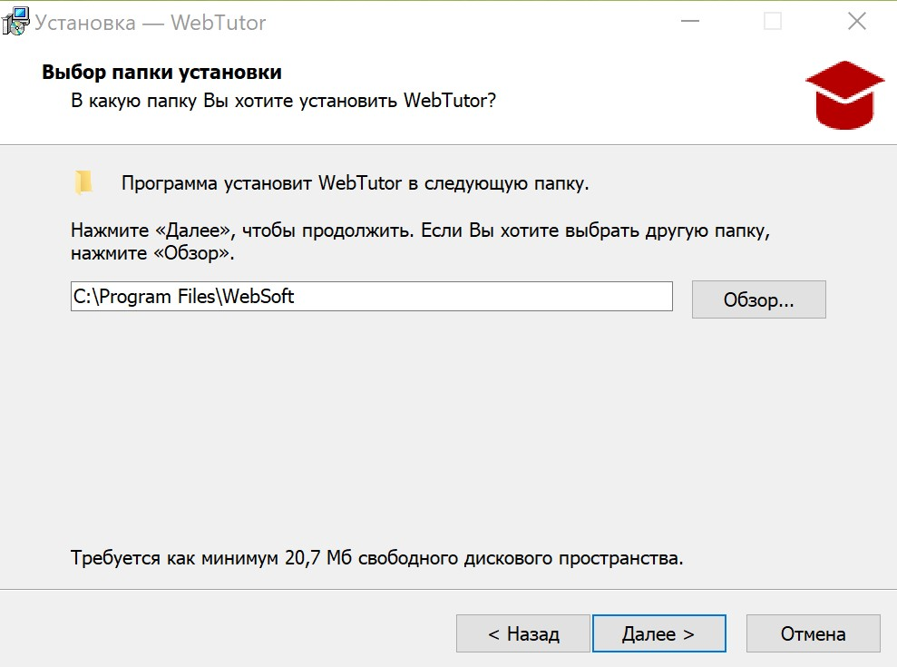

7. Жмем `Далее`  

   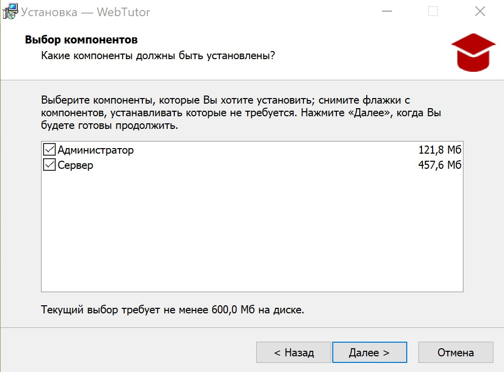

8. Жмем `Далее`  

   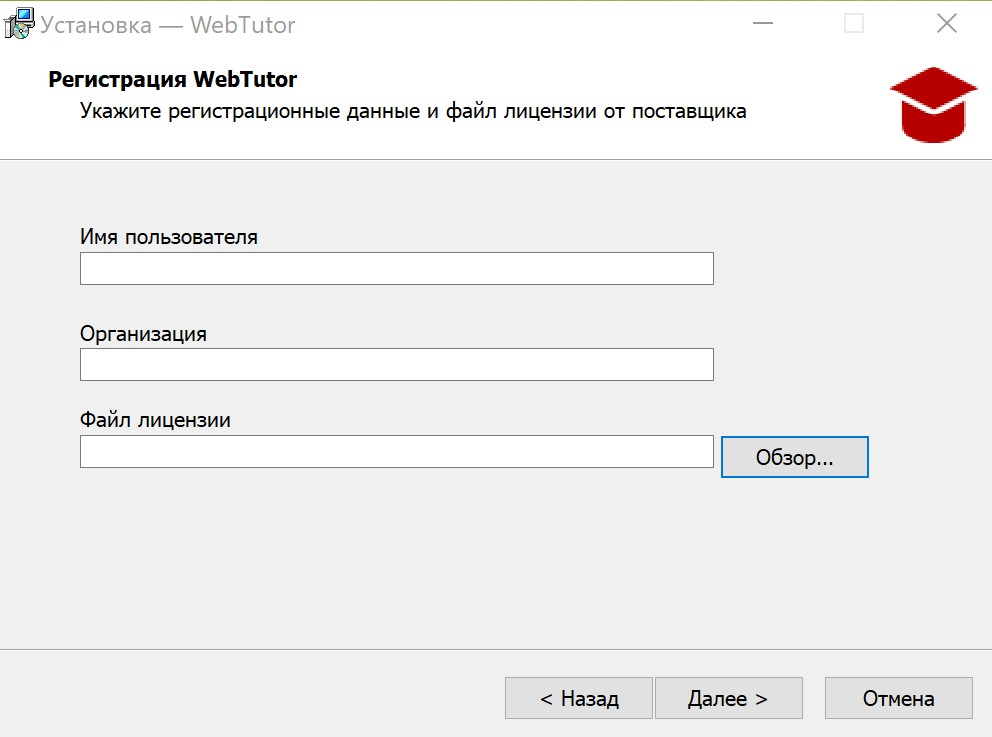

9. Жмем `Далее`  

   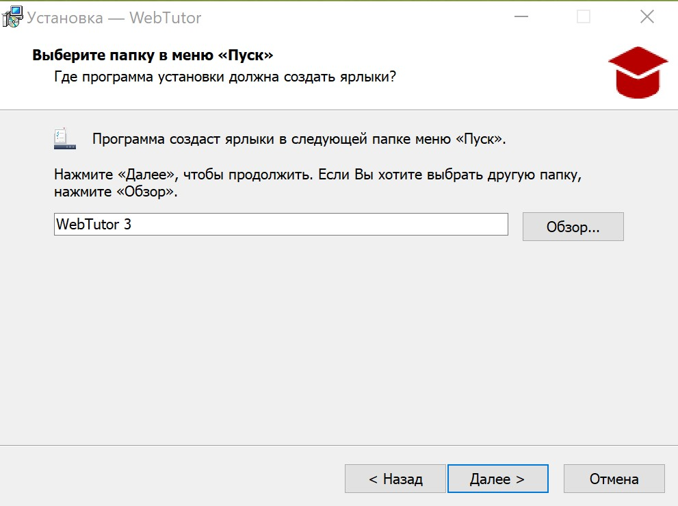

10. Жмем `Установить`  

    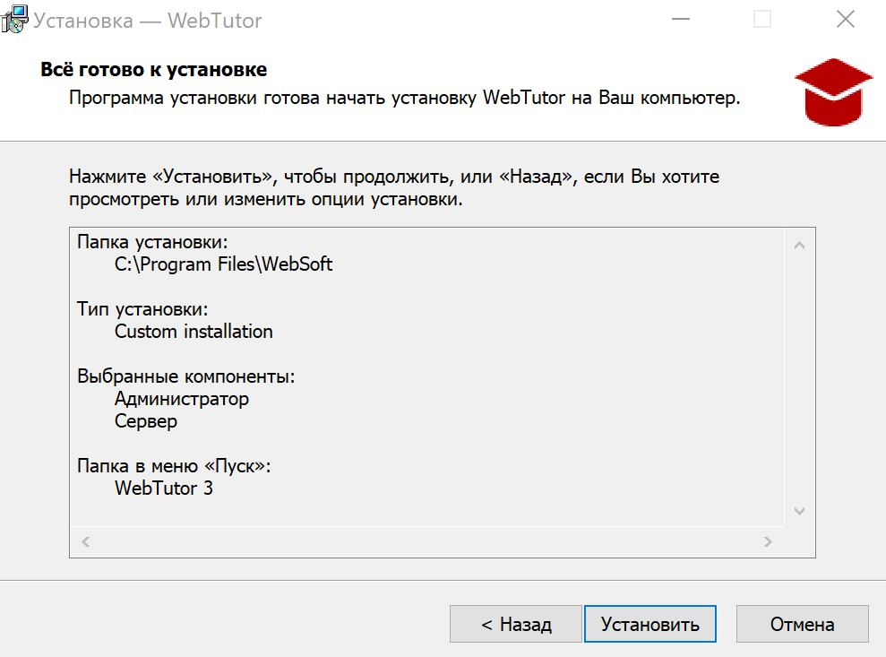

11. Жмем `Завершить`  

    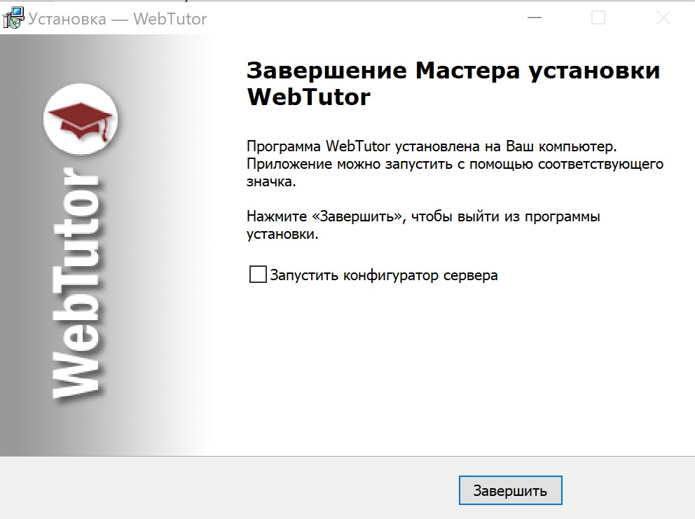

12. Переходим в `C:\Program Files\WebSoft`, жмем по папке `WebTutorServer` правой кнопкой мыши, затем на `Properties (Свойства)`

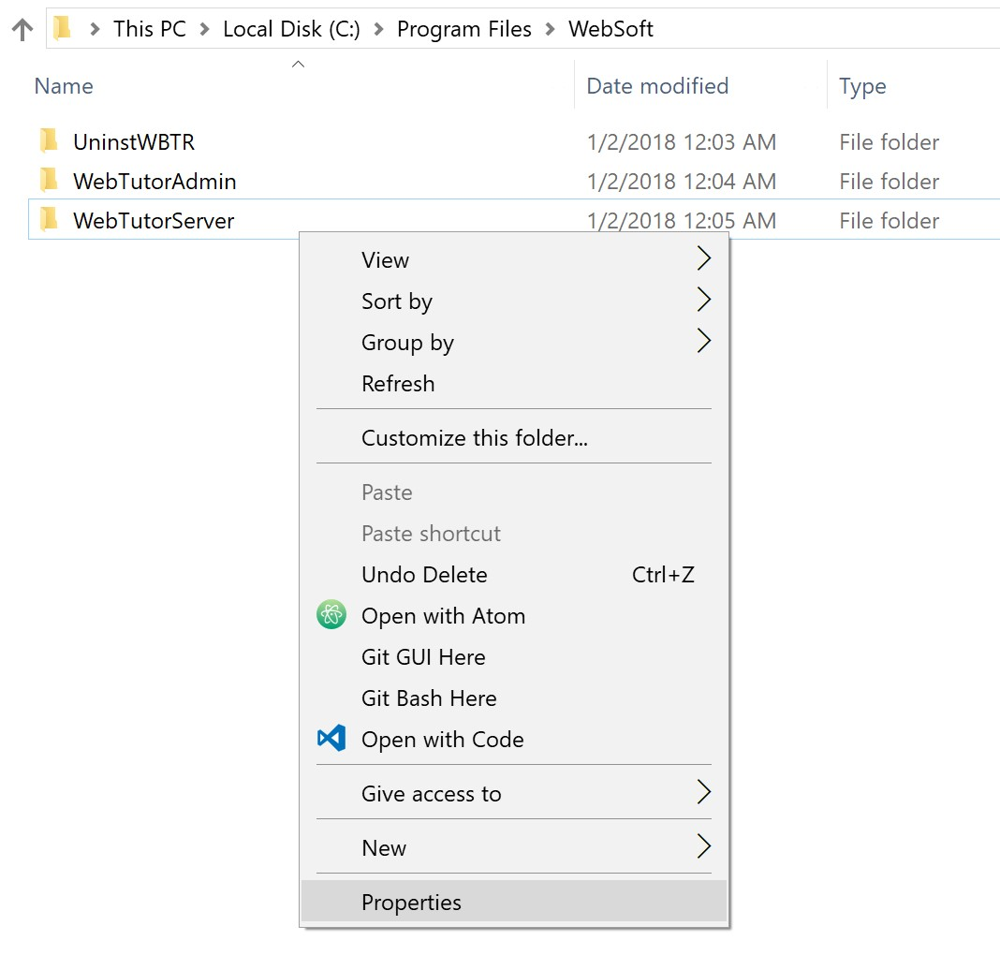

13. В закладке `Security (Безопасность)`, жмем `Edit... (Изменить...)`

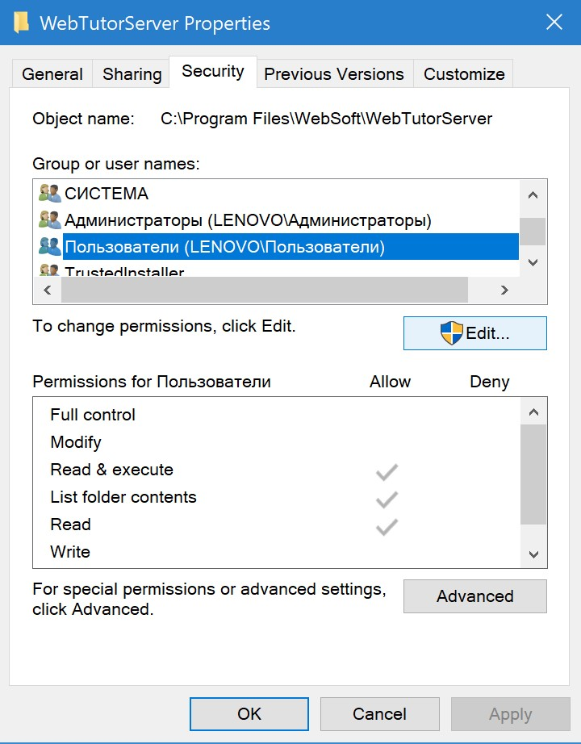

14. В открывшемся окне выбираем группу `Пользователи` и ставим галку `Full Control`

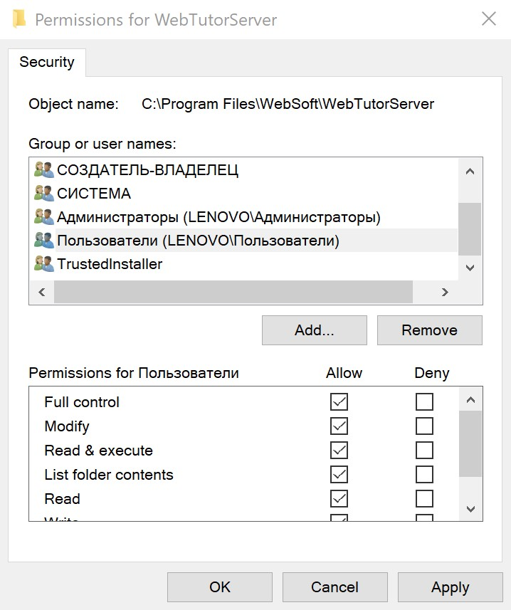

15. Затем жмем `Add... (Добавить)`, в открывшемся окне пишем `Network Service`, жмем `Check Names (Проверить имена)`, затем `OK`

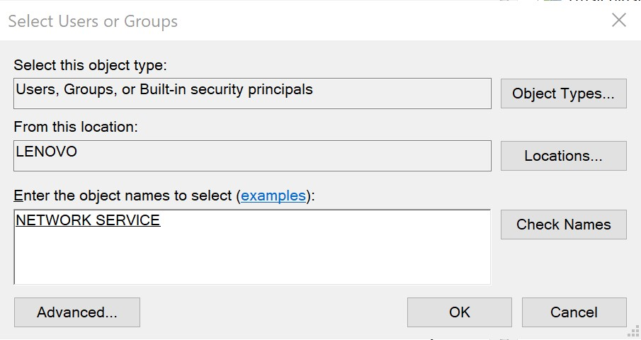

16. Выбираем появившуюся группу `NETWORK SERVICE` и ставим галку напротив `Full Control`, после чего жмем `OK`

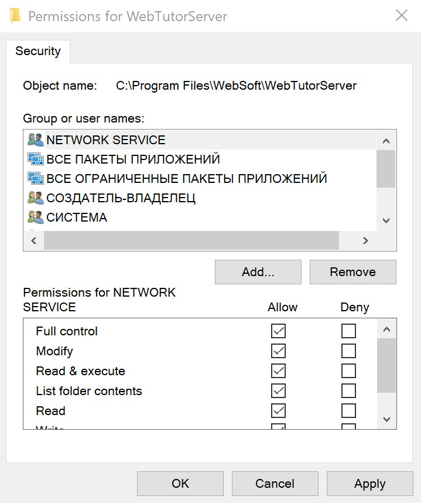

17. Аналогично нужно выдать права группе `Пользователи` для папки `C:\Program Files\WebSoft\WebTutorAdmin`

18. ::: warning Внимание                
    На данном этапе будьте особенно внимательны и делайте точно, как здесь написано, иначе велика вероятность, что на следующих этапах установки возникнут ошибки.  
    У многих людей из-за некорректного исполнения данного этапа на последующих этапах, возникали различные "эксклюзивные" ошибки, на решение которых уходило по несколько дней, хотя проблема скрывалась именно тут.

    Запускаем 64-битную командную строку от имени администратора `C:\Windows\SysWOW64\cmd.exe`  
    Запускаем 32-битную командную строку от имени администратора `C:\Windows\System32\cmd.exe`

    Командные строки запускаем как показано на принтскрине:  
    
    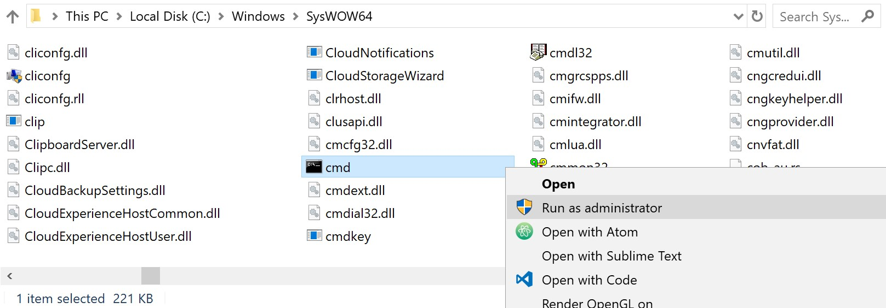

    В 32-битной командной строке пишем:  
    `cd C:\Program Files\WebSoft\WebTutorServer\storage` + Enter  
    `install64.cmd` + Enter  
    В 64-битной командной строке:  
    `cd C:\Program Files\WebSoft\WebTutorServer\storage` + Enter  
    `install32.cmd` + Enter:::

