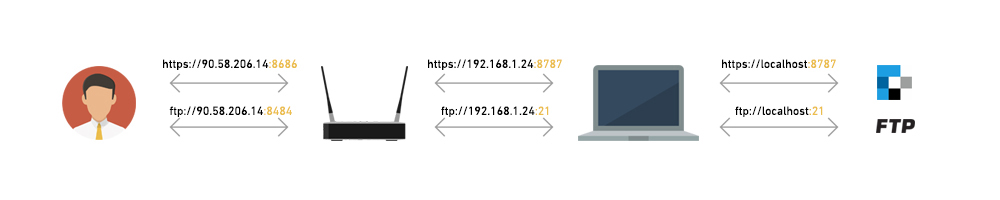
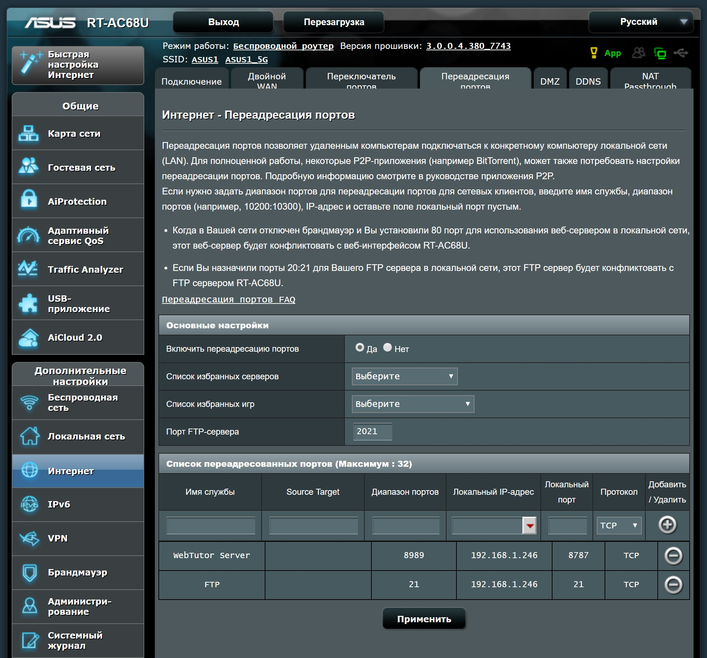
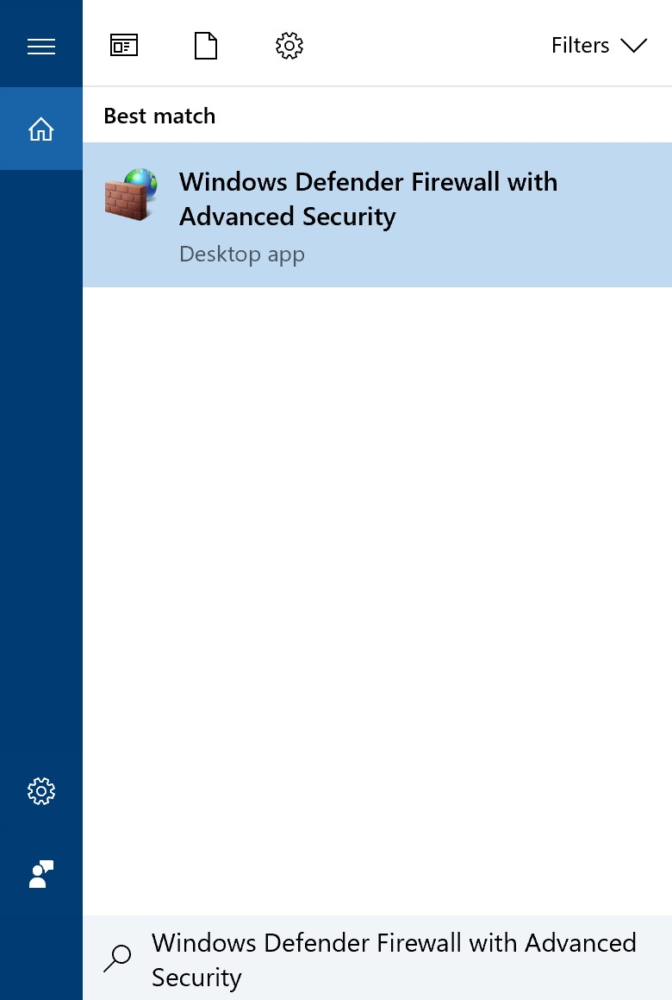
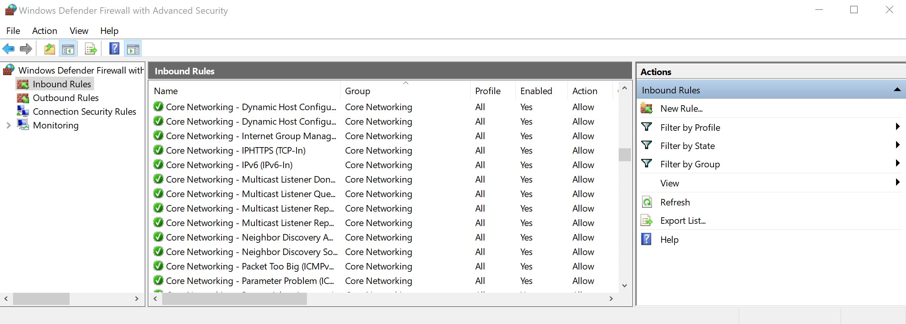
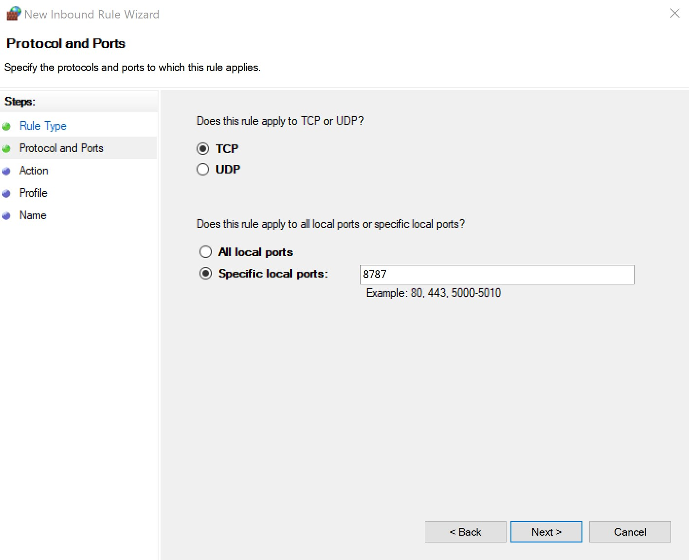
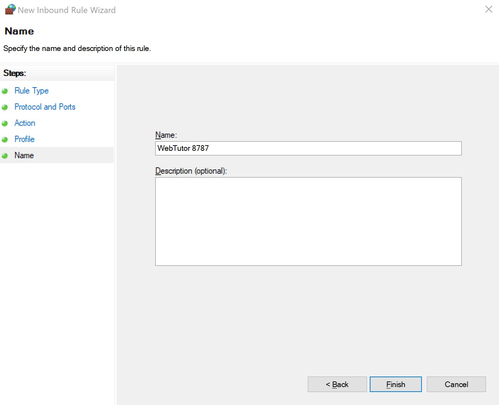

# Доступ из интернета

Для того, чтобы сервер WebTutor и FTP стали доступны из интернета необходимо осуществить переадресацию портов и при необходимости открыть используемые порты в файерволе.

Для осуществления доступа из интернета, у вас должен быть интернет с выделенным ip-адресом (данная услуга предоставляется интернет-провайдером). Также у вашего компьютера в локальной сети должен быть статический ip-адрес.

Если в двух словах, то люди из интернета будут делать запросы к вашему роутеру, а он в зависимости от запроса, будет редиректить в соответсвующее место в вашей локальной сети.

То есть будет как на картинке выше(только у вас будут другие ip-адреса и порты).

Что происходит на картинке:

1. Пользователь из интернета делает запрос к `https://90.58.206.14:8686`
2. Запрос приходит на ваш роутер
3. Роутер обрабатывает запрос, редиректит на `https://192.168.1.24:8787`
4. Запрос приходит на ваш компьютер
5. Компьютер обрабатывает запрос, редиректит на `https://localhost:8787`
6. Запрос приходит на сервер WebTutor
7. WebTutor обрабатывает запрос, формирует ответ
   Ответ идет тем же путем, только наоборот.

C FTP тоже самое, только все идет по протоколу `ftp://`

## Переадресация портов

Переадресация портов осуществляется в настройках роутера. Роутеры у всех разные и интерфейсы для настройки сильно отличаются. Попробуйте самостоятельно зайти в настройки роутера и осуществить переадресацию, если не получится попробуйте поискать решение в интернете.

Для примера, посмотрим как делается переадресация на роутере Asus RT-AC68U (у вас будет что-то подобное):

1. По адресу [http://192.168.1.1](http://192.168.1.1) заходим в настройки роутера
2. Заходим в раздел `Интернет` - `Переадресация портов`
3. Добавляем переадресацию для сервера WebTutor и FTP

   

## Открытие портов

Если после настройки переадресации портов в вашем роутере, все работает, то можете пропустить данный раздел.

Но скорее всего не работает, потому что порты на вашем компьютере закрыты файерволом. Файервол может быть стандартный, который встроен в Windows или же сторонний, который обычно устанавливается совместно с антивирусом. Если у вас установлен антивирус, то поищите в интернете, как можно в нем открыть порты. Если у вас нет антивируса, то вот как открыть порты в Windows (хотя возможно такой вариант будет работать, даже если у вас установлен антивирус):

Допустим на вашем компьютере, WebTutor работает на порте 8787 и вам необходимо его открыть.

1. В поиске Windows пишем `Windows Defender Firewall with Advanced Security`, заходим туда  
   
   

2. Жмем на `Inbound Rules (Входящие правила)`

3. Жмем на `New Rule...`  
   
   

4. Выбираем `Port`, жмем `Next`  
   
   

5. Пишем порт `8787`, жмем `Next`  
   
   

6. Жмем `Next`

7. Пишем **Name** = WebTutor 8787, жмем `Finish`  
   
   

8. Аналогично добавляем такое же правило в разделе `Outbound Rules (Исходящие правила)`

