# Запуск WebTutor

1. Заходим в IIS и запускаем: 

    * **Сервер**  

    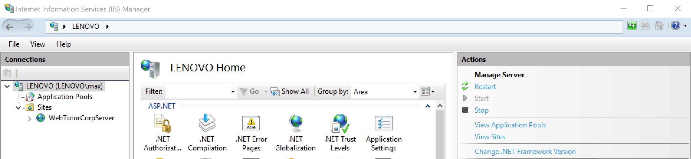  

    * **Пул WebTutorCorpServer**  

    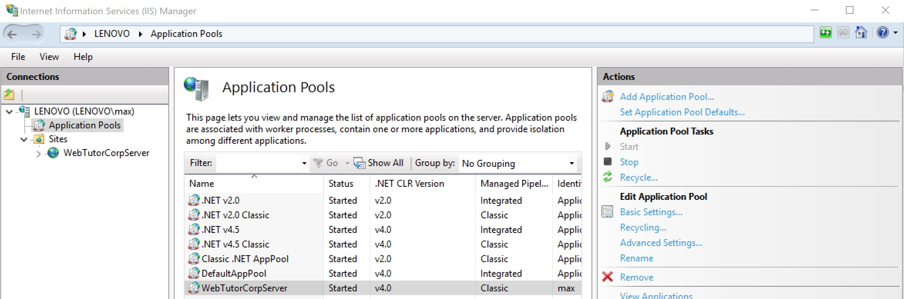

    * **Сайт WebTutorCorpServer**  

    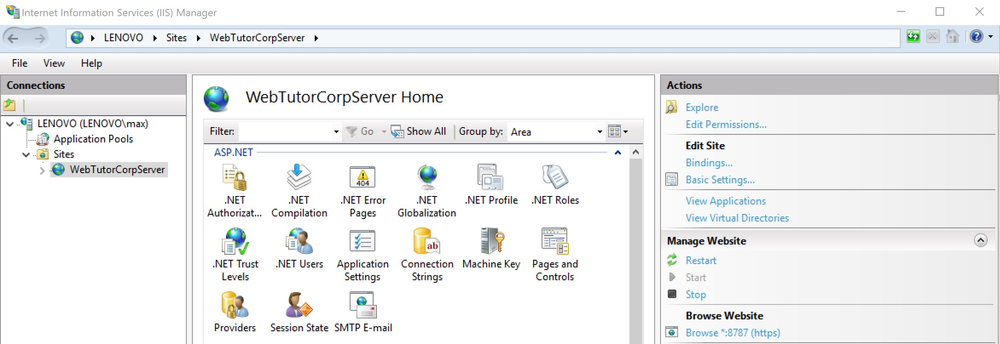

2. Открываем в браузере страницу [https://localhost:8787](https://www.gitbook.com/book/maksimyurkov/progressive-webtutor/edit#), она будет в статусе загрузки.  
   Загружаться она будет до тех пор, пока в SQL базе данных `wt` не создадутся все необходимые таблицы WebTutor, это займет ~ 10 минут. (можете посмотреть как таблицы появляются в SSMS)

   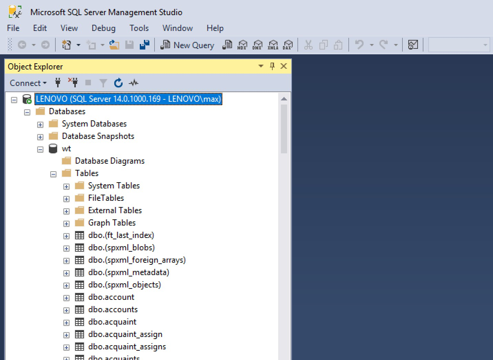

3. Когда создание таблиц в SQL завершится, по адресу [https://localhost:8787](https://localhost:8787) будет такая картина  

   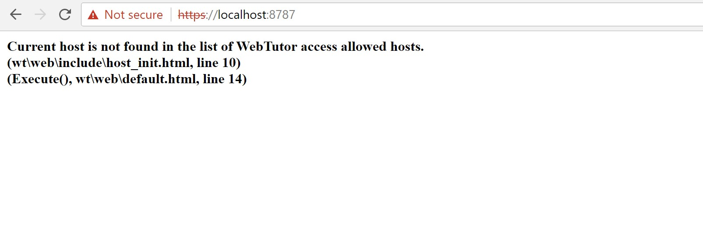

4. Запускаем WebTutor Administrator

5. Пишем `localhost:8787`  

   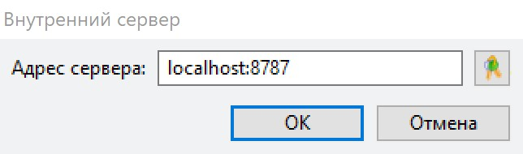

6. Нажимаем на `Русский`  

   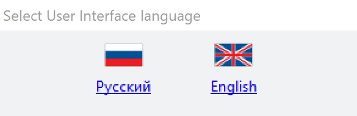

7. Вводим логин: `user1`, пароль: `user1`, жмем `ОК`  

   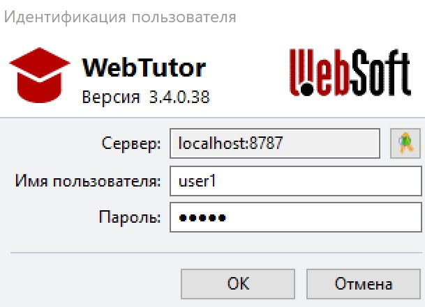

8. Переходим в  `Портал` - `Узлы` - `Хост по умолчанию`  

   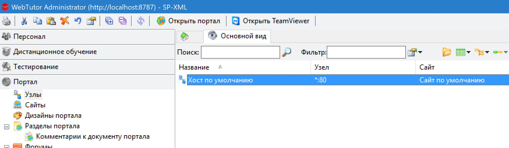

9. Меняем порт на `8787`  

   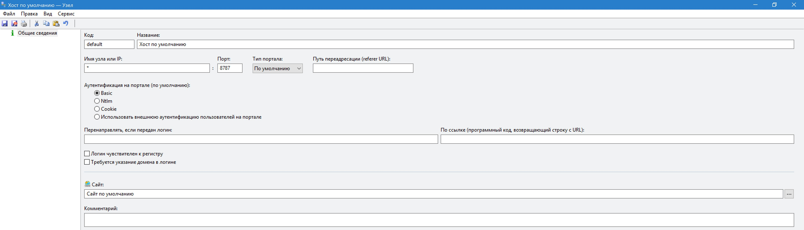

10. После этого портал начнет корректно открываться по адресу [https://localhost:8787](https://localhost:8787)  

   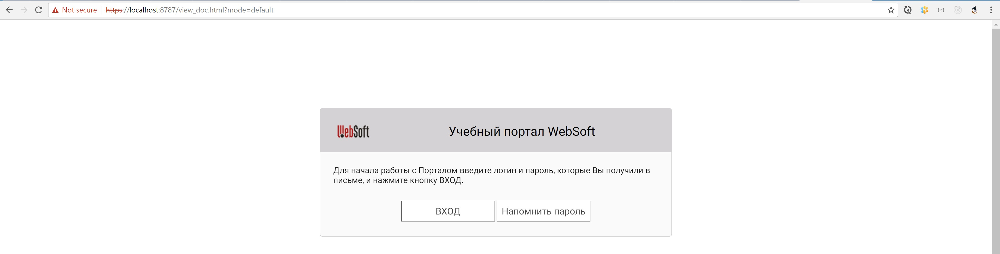

